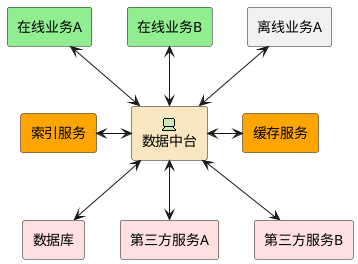
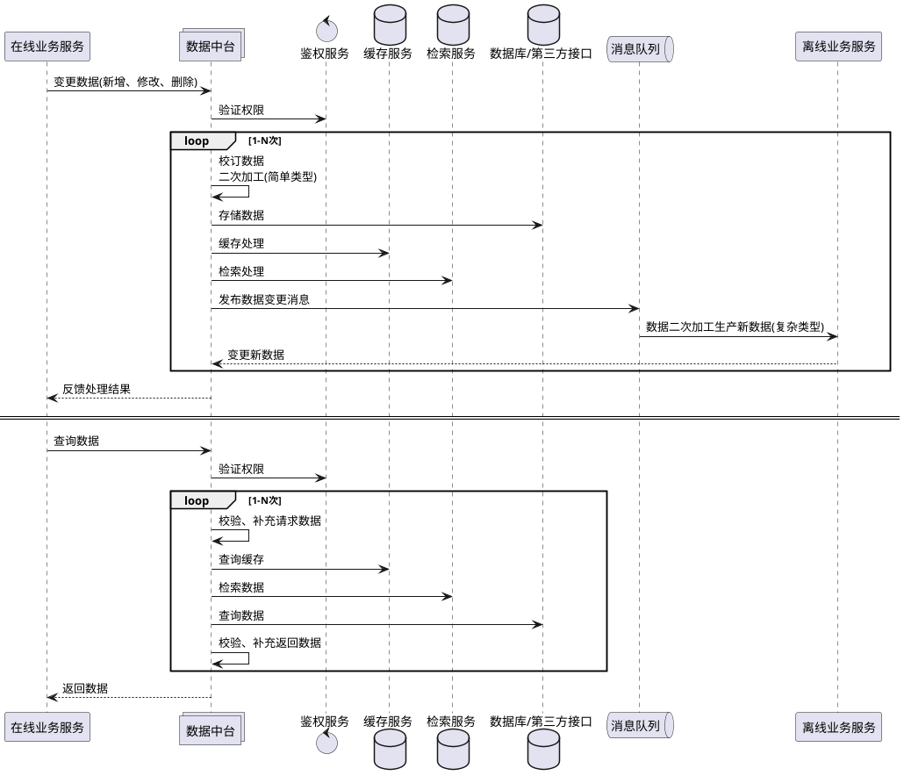
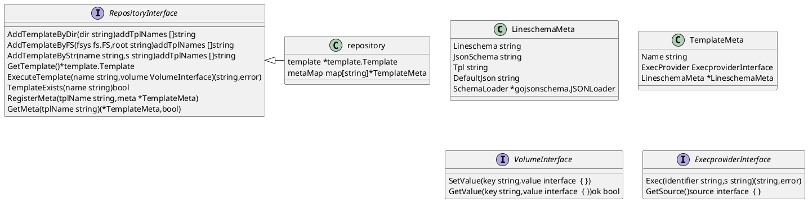

# templatemap

## 业务架构图


## 时序图



## 仓库uml


## 执行器uml
```platuml
@startuml


 class RequestData {
  URL string
  Method string
  Header http.Header
  Cookies []*http.Cookie
  Body string
}

 class ResponseData {
  HttpStatus string
  Header http.Header
  Cookies []*http.Cookie
  Body string
  RequestData *RequestData
}

 class CURLExecProviderConfig {
  Proxy string
  LogLevel string
  Timeout int
  KeepAlive int
  MaxIdleConns int
  MaxIdleConnsPerHost int
  IdleConnTimeout int
}

 class CURLExecProvider {
  Config CURLExecProviderConfig
  client *http.Client
  clinetOnce sync.Once
}

 class DBExecProviderConfig {
  DSN string
  LogLevel string
  Timeout int
}

 class DBExecProvider {
  Config DBExecProviderConfig
  db *sql.DB
  dbOnce sync.Once
}


 interface ExecproviderInterface  {
  Exec(identifier string,s string)(string,error)
  GetSource()source interface  { }
}


.ExecproviderInterface <|- .CURLExecProvider
.ExecproviderInterface <|- .DBExecProvider
@enduml
```
## 软件执行流程图
```platuml
@startuml

start
  :接收输入(input);
  if(鉴权) then(通过)
  if(模板未加载) then(是)
   :加载模板;
 endif
:格式化输入;
if (校验输入) equals(通过)then
:初始化容器(volume)数据;
:调用API模板主函数;
repeat: 执行内嵌模板/远程调用;
if(发生错误) then(抛出错误)
break
endif
repeat while (更多模板?)
else(不通过)
endif
endif
:格式化输出;
:输出(output);
stop
@enduml

```