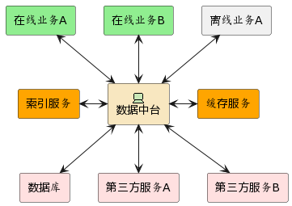
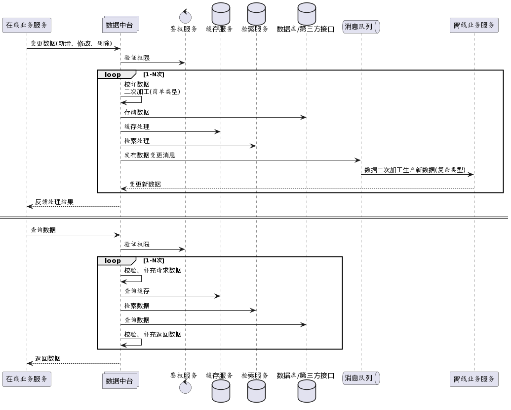
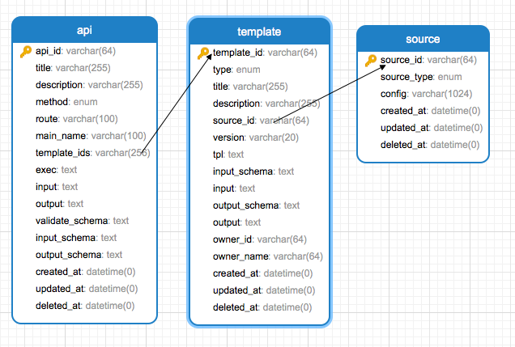

# 面向数据架构在企业数字化中的探索-设计说明书
## 引言
当下企业数字化转型,有着广泛的需求.企业通过数字化方案解决问题时呈现复杂、多变的特征.传统的面向对象编程是面向问题域编程,web编程中更倾向于将数据结构、数据操作、数据转换、辅助数据等角色按照问题域封装成一个整体对象,使用的时候将数据按照预定义的格式和对象关联,多个对象之间按照固定的顺序、组合达到解决问题的目的.这种方式更适合变动少的问题域,如文件操作系统,稳定的概念有打开、关闭、读取、写入等操作.但是面对频繁变动的需求,未来的新功能需求可能破坏了既定的对象结构,甚至相互冲突,导致原本设计良好的架构出现退化,最终导致杂乱无章,难以维护.产生技术负债. 而面向数据不关心问题域,只关注数据本身,以数据为中心,对数据进行存储、组合、转换和传输,当数据赋予具体意义时才关联问题域.面向数据的架构很好的将数据模型和业务模型解耦.更能适应变化频繁的业务需求.
## 软件总体设计
本软件采用分层思想,将web应用分成业务表达、数据处理两部分,分别对应面向领域和面向数据模型,通过分开部署的方式划清边界.针对数据模型提供面向数据架构的通用数据中台,软件主要包含数据层和业务层交互的API、数据处理功能
### 需求概括
1. 和业务层交互的API创建和管理.包含API定义、API实现及管理,以及API授权
2. 数据处理. 包含数据存储、使用、整合、异构、校订等
### 功能概括
1. 与业务层交互API功能
    1.1 API模型设计
    1.2 API管理(创建、修改、版本迁移)
    1.3 API权限管理及授权
2. 数据处理
    2.1 数据的存储.支持多源存储(如关系型、非关系型、第三方服务存储)
    2.2 数据的使用.支持多源数据获取(如从数据库、es、第三方接口获取数据源)
    2.3 数据整合. 支持将不同数据源安需求整合梳理,汇总成单个数据源对业务层提供简洁的API
    2.4 数据异构. 支持将多源数据清洗加工,生产新数据并存储,满足更多业务数据需求
    2.5 数据校订. 对数据有效性和完备性校订,确保数据完备、有序
### 整体架构图
软件采用mysql管理数据、jsonschema以及变种jsonschemaline(自主发明的数据表达格式)作为元数据描述格式. 基于go语言开发.支持linux、window、mac 多平台部署.
整体架构图:

### 时序图
数据中台主要围绕提供数据、处理数据、存储数据构建,具体时序图如下:

### 实体关系设计
软件主要有API、template、source等3个实体,具体字段如下:

### 软件uml图
1. 

